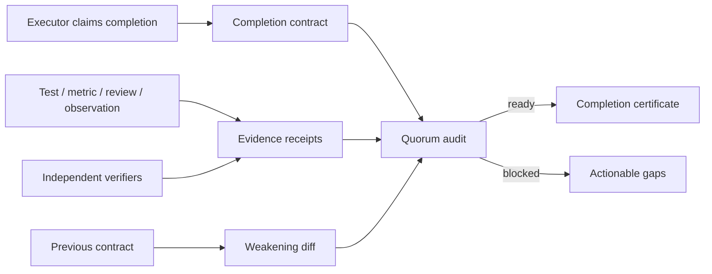

# EvidenceQuorum

**Independent evidence quorum and completion-certificate compiler for AI agents.**

An agent saying “done” is a claim, not proof. EvidenceQuorum evaluates that claim against an explicit completion contract: every acceptance criterion can require multiple distinct verifiers, fresh evidence, heterogeneous evidence types, required tags, and a negative-path check. Passing contracts produce a portable, tamper-evident completion certificate.

> Experimental developer tool. EvidenceQuorum verifies declared evidence policy; it does not prove that an external artifact is truthful.

## Why this exists

Agent workflows commonly stop when one tool exits successfully or the executing agent reports completion. That leaves several gaps:

- the executor can approve its own output;
- one stale receipt can be reused as proof for a new run;
- the same artifact can be counted against unrelated criteria;
- only a happy path may be tested;
- acceptance requirements can be silently weakened before evaluation.

EvidenceQuorum treats completion as a small consensus problem. It is not another test runner: existing tools produce evidence; EvidenceQuorum decides whether the combined receipts are sufficient, independent, current, unreused, and still measured against the intended contract.

## What makes it different

| Control | Question answered |
| --- | --- |
| Independent verifier quorum | Did enough distinct parties other than the executor validate this? |
| Heterogeneous evidence | Do we have the declared combination of tests, reviews, metrics, observations, or artifacts? |
| Freshness windows | Was the evidence captured close enough to this completion claim? |
| Negative-path requirement | Did at least one passing receipt cover failure behavior? |
| Digest anti-reuse | Was one artifact counted toward multiple criteria? |
| Contract regression diff | Were completion requirements weakened since the previous contract? |
| Certificate compiler | Can another system verify exactly what was certified? |

## Quick start

Requires Node.js 20+ and pnpm 10.

```bash
pnpm install
pnpm check

# The fixture uses a fixed timestamp so its result stays reproducible.
pnpm quorum audit examples/certified-release.json --at 2026-07-29T04:30:00.000Z

pnpm quorum certify examples/certified-release.json \
  --at 2026-07-29T04:30:00.000Z \
  --output .evidence-quorum/completion.md \
  --receipt .evidence-quorum/certificate.json

pnpm quorum verify .evidence-quorum/certificate.json \
  --contract examples/certified-release.json
```

Expected audit:

```text
EvidenceQuorum · checkout-v42-completion
Status: READY · score 100/100 · coverage 100%

✓ tests-pass · 2/2 verifiers
✓ service-healthy · 2/2 verifiers
✓ runbook-linked · 1/1 verifiers
```

Try a deliberately dishonest completion:

```bash
pnpm quorum audit examples/false-completion.json --at 2026-07-29T04:30:00.000Z
```

It is blocked for self-verification, stale evidence, a missing negative test, insufficient quorum, a current failure, and a digest reused across criteria.

## CLI

```text
evidence-quorum audit <contract.json> [--at <ISO date>] [--json]
evidence-quorum explain <contract.json> --criterion <id> [--at <ISO date>]
evidence-quorum certify <contract.json> --output <completion.md> --receipt <certificate.json>
evidence-quorum verify <certificate.json> [--contract <contract.json>]
evidence-quorum diff <previous.json> <next.json> [--json]
evidence-quorum init [path]
```

Exit codes are automation-friendly: `0` ready/valid, `2` blocked, `3` warning, `4` weakened contract, and `5` invalid input.

## Studio

```bash
pnpm install
pnpm dev
```

Open the printed local URL. The Studio lets you edit a completion contract, inspect each criterion and its verifier quorum, see rejected evidence, and download a certificate. Analysis runs entirely in the browser; contract data is not sent to a backend.

## Contract model



The complete field reference is in [docs/CONTRACT.md](docs/CONTRACT.md). Start with [examples/certified-release.json](examples/certified-release.json).

## Agent integration

Keep generation and verification roles separate:

1. Define acceptance criteria before execution.
2. Let existing test, observability, review, and artifact systems emit receipts.
3. Assign verifiers that are independent from the executor where the risk warrants it.
4. Run `audit`; use `explain` to feed specific gaps back to the agent.
5. Run `diff` against the approved baseline.
6. Publish a certificate only after the contract is ready.

See [docs/INTEGRATION.md](docs/INTEGRATION.md) for a CI example and [docs/THREAT-MODEL.md](docs/THREAT-MODEL.md) for trust boundaries.

## Research context

EvidenceQuorum is inspired by current work on agent evaluation and externally gated completion:

- NIST’s [Building Evaluation Probes into Agentic AI](https://www.nist.gov/programs-projects/building-evaluation-probes-agentic-ai) describes adversarial verifiers, machine-readable audit trails, and mappings from claims to evidence.
- The paper [Verify-Gated Completion](https://arxiv.org/abs/2605.17998) studies completion protocols where externally checked evidence gates termination.
- NIST’s [AI Test, Evaluation, Validation and Verification](https://www.nist.gov/ai-test-evaluation-validation-and-verification-tevv) program provides the broader TEVV context.

This repository is an original experimental implementation of a multi-receipt quorum policy and certificate format. The name search and public repository search performed before publication found no exact `EvidenceQuorum` project, but that is not a legal or global uniqueness guarantee.

## Repository layout

```text
packages/core     Policy engine, canonical hashing, audit, diff, certificate
packages/cli      Automation-friendly command-line interface
apps/studio       Local-first browser workbench
examples          Passing, failing, and weakened contracts
docs              Protocol, integration, and threat-model guides
```

## Security

Digests bind a receipt to an artifact identifier but do not fetch or authenticate that artifact. Production integrations should sign receipts, pin verifier identities, protect the baseline contract, and store certificates in an append-only system. Read [SECURITY.md](SECURITY.md) before using EvidenceQuorum for high-impact decisions.

## Contributing

Ideas, adversarial fixtures, verifier adapters, and specification feedback are welcome. See [CONTRIBUTING.md](CONTRIBUTING.md).

MIT licensed.
